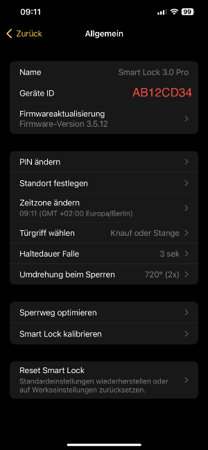
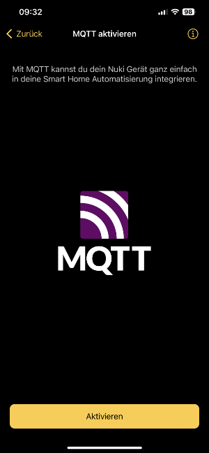
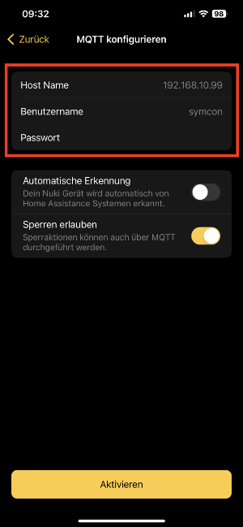
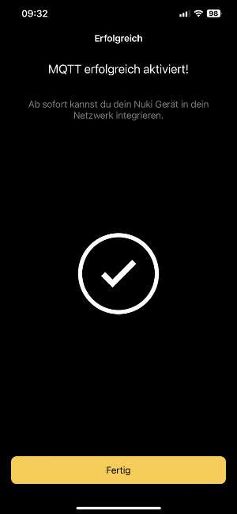

[](https://nuki.io/de/)

### Nuki Smart Lock (MQTT API)

[]()

Dieses Modul integriert das [Nuki Smart Lock 3.0 Pro](https://nuki.io/de/smart-lock-pro/) in [IP-Symcon](https://www.symcon.de) mittels der [Nuki MQTT API](https://developer.nuki.io/c/apis/mqtt-api/42).  
Das Nuki Smart Lock macht aus deinem Türschloss einen smarten Türöffner.

Für dieses Modul besteht kein Anspruch auf Fehlerfreiheit, Weiterentwicklung, sonstige Unterstützung oder Support.  
Bevor das Modul installiert wird, sollte unbedingt ein Backup von IP-Symcon durchgeführt werden.  
Der Entwickler haftet nicht für eventuell auftretende Datenverluste oder sonstige Schäden.  
Der Nutzer stimmt den o.a. Bedingungen, sowie den Lizenzbedingungen ausdrücklich zu.  

### Inhaltsverzeichnis

1. [Funktionsumfang](#1-funktionsumfang)
2. [Voraussetzungen](#2-voraussetzungen)
3. [Software-Installation](#3-software-installation)
4. [Einrichten der Instanzen in IP-Symcon](#4-einrichten-der-instanzen-in-ip-symcon)
5. [Statusvariablen und Profile](#5-statusvariablen-und-profile)
6. [WebFront](#6-webfront)
7. [PHP-Befehlsreferenz](#7-php-befehlsreferenz)
   1. [Zusperren](#71-zusperren)
   2. [Aufsperren](#72-aufsperren)
   3. [Sperraktionen](#73-sperraktionen)
8. [Changelog](#8-Changelog)

### 1. Funktionsumfang

* Sperraktionen (Schloss zu- und aufsperren inkl. weiterer Funktionen)
* Sperrzustand anzeigen (diverse)
* Informationen zu einem vorhandenen Türsensor anzeigen
* Informationen zu einem vorhandenen Keypad anzeigen
* Protokoll

### 2. Voraussetzungen

* IP-Symcon ab Version 6.3
* Nuki Smart Lock 3.0 Pro
* WLAN-Verbindung
* Aktivierte MQTT API Funktion mittels der Nuki iOS / Android App
* MQTT Server Port 1883

### 3. Software-Installation

* Bei kommerzieller Nutzung (z.B. als Einrichter oder Integrator) wenden Sie sich bitte zunächst an den Autor.
* Über den Module-Store das `Nuki MQTT`-Modul installieren.

### 4. Einrichten der Instanzen in IP-Symcon

* In IP-Symcon an beliebiger Stelle `Instanz hinzufügen` auswählen und `Nuki Smart Lock (MQTT API)` auswählen, welches unter dem Hersteller `NUKI` aufgeführt ist.
* Es wird eine neue `Nuki Smart Lock (MQTT API)` Instanz angelegt.
* Sofern noch keine `MQTT Server (Splitter)` Instanz in IP-Symcon vorhanden ist, wird automatisch eine `MQTT Server (Splitter)` Instanz angelegt.
* Vergeben Sie einen Benutzernamen und ein Passwort.
* Sofern noch keine `Server Socket (I/O)` Instanz in IP-Symcon vorhanden ist, wird automatisch eine `Server Socket (I/O)` Instanz angelegt.
* Aktivieren Sie die Instanz und legen als Port 1883 fest.

__Konfigurationsseite__:

| Name                | Beschreibung                              |
|---------------------|-------------------------------------------|
| MQTT Topic          | Name des MQTT Topics: nuki/nuki_id_in_hex |
| Türsensor           | Türsensor Informationen anzeigen          |
| Keypad              | Keypad Informationen anzeigen             |
| Protokoll verwenden | Protokoll verwenden                       |
| Maximalen Einträge  | Anzahl der maximalen Einträge             |

__Schaltflächen im Aktionsbereich__:

| Name                 | Beschreibung                       |
|----------------------|------------------------------------|
| Entwicklerbereich    |                                    |
| Attribute anzeigen   | Zeigt die vorhandenen Attribute an |

__Vorgehensweise__:  

Geben Sie das MQQT Topic (nuki/nuki_id_in_hex) an.  
Beispiel:  
nuki/AB12CD34

Die Nuki Gerät ID finden Sie in der Nuki iOS / Android App.

Meine Geräte verwalten -> Smart Lock -> [Name des Smartlocks] -> Funktionen & Konfiguration -> Allgemein:  

[]()  

Wenn Sie die Konfiguration in IP-Symcon abgeschlossen haben, aktivieren Sie die MQTT Funktion für das Nuki Smart Lock mittels der Nuki iOS / Android App. 

Meine Geräte verwalten -> Smart Lock -> [Name des Smartlocks] -> Funktionen & Konfiguration -> MQTT:

[]()  

Geben Sie die IP-Adresse Ihres IP-Symcon Servers, den Benutzernamen und das Passwort an, welches Sie zuvor vergeben haben.

[]()  

[]()

### 5. Statusvariablen und Profile

Die Statusvariablen/Kategorien werden automatisch angelegt.  
Das Löschen einzelner kann zu Fehlfunktionen führen.

##### Statusvariablen

| Name                      | Typ     | Beschreibung                                            |
|---------------------------|---------|---------------------------------------------------------|
| LockAction                | integer | Sperraktionen (auf- und zusperren + weitere Funktionen) |
| LockState                 | integer | Sperrzustand (diverse)                                  |
| BatteryCritical           | boolean | Batteriestatus (OK, Schwache Batterie)                  |
| BatteryChargeState        | integer | Batterieladung (in %)                                   |
| BatteryCharging           | boolean | Batterieaufladung (In- / Aktiv)                         |
| LastUpdate                | string  | Letzte Aktualisierung (MQTT Nachricht)                  |
| DoorSensorState           | integer | Türsensorstatus (diverse)                               |
| DoorSensorBatteryCritical | boolean | Türsensor Batteriestatus (OK, Schwache Batterie)        |
| KeypadBatteryCritical     | boolean | Keypad Batteriestatus (OK, Schwache Batterie)           |
| Protocol                  | string  | Protokoll                                               |

##### Profile

NUKISLMQTT.InstanzID.Name

| Name                      | Typ     |
|---------------------------|---------|
| LockAction                | integer |
| LockState                 | integer |
| BatteryCritical           | boolean |
| BatteryChargeState        | integer |
| BatteryCharging           | boolean |
| DoorSensorState           | integer |
| DoorSensorBatteryCritical | boolean |
| KeypadBatteryCritical     | boolean |

Wird die `Nuki Smart Lock (MQTT API)` Instanz gelöscht, so werden automatisch die oben aufgeführten Profile gelöscht.

### 6. WebFront

Die Funktionalität, die das Modul im WebFront bietet:  

* Sperraktionen (auf- und zusperren + weitere Funktionen)
* Sperrzustand anzeigen (diverse)
* Informationen zum Türsensor anzeigen
* Informationen zum Keypad anzeigen
* Protokoll
 
### 7. PHP-Befehlsreferenz

#### 7.1 Zusperren

```
NUKISLMQTT_Lock(integer InstanceID);
```

Der Befehl liefert keinen Rückgabewert.

| Parameter    | Beschreibung                              |
|--------------|-------------------------------------------|
| `InstanceID` | ID der Nuki Smart Lock (MQTT API) Instanz |

Beispiel:  
> NUKISLMQTT_Lock(12345); 

---

#### 7.2 Aufsperren

```
NUKISLMQTT_Unlock(integer InstanceID);
```

Der Befehl liefert keinen Rückgabewert.

| Parameter    | Beschreibung                              |
|--------------|-------------------------------------------|
| `InstanceID` | ID der Nuki Smart Lock (MQTT API) Instanz |

Beispiel:
> NUKISLMQTT_Unlock(12345); 

---

#### 7.3 Sperraktionen

Schaltet eine bestimmte Aktion des Nuki Smart Locks.

```
NUKISLMQTT_SetLockAction(integer InstanceID, integer Action);  
```

Der Befehl liefert keinen Rückgabewert.

| Parameter    | Beschreibung                              |
|--------------|-------------------------------------------|
| `InstanceID` | ID der Nuki Smart Lock (MQTT API) Instanz |

| Parameter | Wert | Smart Lock Aktion        | Smart Lock Aktion (deutsch)                                |
|-----------|------|--------------------------|------------------------------------------------------------|
| `Action`  | 1    | unlock                   | aufsperren                                                 |
|           | 2    | lock                     | zusperren                                                  |
|           | 3    | unlatch                  | entriegeln                                                 |
|           | 4    | lock ‘n’ go              | automatisch aufsperren und wieder zusperren                |
|           | 5    | lock ‘n’ go with unlatch | automatisch aufsperren mit entriegeln und wieder zusperren |
|           | 6    | full lock                | Vollverriegelung 2x (720)                                  |

Beispiele:  
> //Zusperren  
> NUKISLMQTT_SetLockAction(12345, 2); 

> //Aufsperren  
> NUKISLMQTT_SetLockAction(12345, 1);  

### 8. Changelog

| Version | Build | Beschreibung     |
|---------|-------|------------------|
| 1.0     | 1     | Initiale Version |